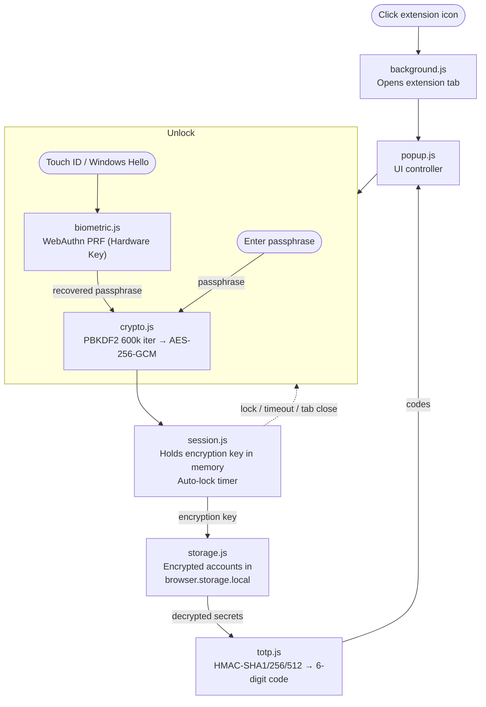

# ReDD 2FA

Simple, secure, local-only authenticator browser extension for time-based one-time passwords (TOTP). Lets you use your computer for 2FA, so you can put your phone away when you need to focus.

Built by computer scientists at the University of Oxford (Dr Ulrik Lyngs) and the University of Maastricht (Dr Konrad Kollnig, Henry Tari), as part of the Reduce Digital Distraction Project ([reddfocus.org](https://reddfocus.org)).

- **Chrome Web Store**: https://chromewebstore.google.com/detail/redd-2fa-phone-free-authe/dhkhbjppnoabmglidgfpndfghbhlkgbn
- **Add-ons for Firefox**: https://addons.mozilla.org/en-US/firefox/addon/redd-2fa-simple-authenticator
- **Safari**: not necessary: the native Passwords application (newer Macs) or Safari itself (older Macs, go to Safari > Settings > Passwords) can generate TOTP codes.

## Features

### Security
- **Strong encryption** — AES-256-GCM via Web Crypto API with PBKDF2 key derivation (600,000 iterations, SHA-256)
- **Local-only** — never makes network requests; all data stays on your device
- **Minimal permissions** — only requests `storage`, `tabs`, and `sidePanel`; no host permissions, no remote code
- **Master passphrase** — all account data encrypted at rest; decrypted only while unlocked
- **Passphrase never stored** — only a derived verification token is persisted
- **Memory safety** — encryption key, decrypted TOTP secrets, and in-flight modal inputs (passphrases, secrets) are all wiped from memory on lock or when the side panel is closed
- **Auto-lock** — configurable inactivity timeout (1, 5, 15, 30 minutes, or never) while the side panel is open. Closing the panel wipes the key immediately, so the timeout only matters when the panel is left open and idle
- **Lockout on failed attempts** — progressive cooldown (5s → 30s → 5min), persisted across panel restarts. This deters guessing through the extension UI; an attacker with disk access can copy the encrypted blob and attack it offline at GPU speeds, so passphrase strength remains the primary defense
- **Clipboard auto-clear** — copied codes are removed from clipboard after 30 seconds
- **Constant-time comparison** — passphrase hash verification uses XOR-based comparison to prevent timing attacks
- **Strength-checked passphrases** — new passphrases are validated with hand-rolled, fully-auditable checks for common-password substrings, keyboard walks, repeating patterns, and low character diversity (see `src/passphrase-strength.js`)
- **No secrets in DOM** — TOTP secrets are kept in memory only; never written to HTML attributes

### Biometric Unlock
- **Touch ID / Windows Hello** — optional biometric unlock via WebAuthn
- **Hardware-backed security** — passphrase is encrypted with a PRF-derived key (HKDF → AES-256-GCM) directly from the security chip; no keys are ever stored on disk
- **Windows note** — Windows Hello does not currently support the WebAuthn PRF extension required for secure key derivation from a browser extension. Windows users should select **Google Password Manager** (or another password manager like 1Password) as their passkey provider when prompted, instead of "Windows Hello"
- Biometric data is automatically cleared when passphrase is changed

### Usability
- **Cross-browser** — Chrome, Firefox, and Edge (Manifest V3)
- **Dark / light mode** — auto-detects system preference, or set manually
- **Search & filter** — search accounts by label
- **Copy on click** — tap any account card to copy its current code
- **Progress ring** — visual countdown showing time remaining for each code
- **Change passphrase** — re-encrypts all accounts with a new key
- **Backup / restore** — encrypted JSON export (stores only label + secret pairs); import supports both encrypted backups and plain `otpauth://` URI text files from other authenticator apps
- **Backup status** — inline badge on the Export button warns if no backup has been exported, or if accounts have changed since the last export
- **Plain text URI export** — export accounts as standard `otpauth://` URIs for migrating to another authenticator app
- **Account migration** — view secret keys in the edit view for manual transfer, or use plain text URI export
- **Data loss warning** — clear warning during setup about passphrase recovery

## How It Works

1. On first launch, you create a master passphrase (minimum 12 characters)
2. A 256-bit encryption key is derived from your passphrase using PBKDF2 (600k iterations)
3. All account data is encrypted with AES-256-GCM and stored in `browser.storage.local`
4. When you unlock, the key is re-derived and held in memory for the duration of your session
5. TOTP codes are generated using HMAC-SHA1/256/512 per RFC 6238 — entirely via Web Crypto API
6. On lock (manual, auto-lock timeout, or popup close), the key is wiped from memory



## Loading the Extension

No build step required — the extension runs as vanilla ES modules, and every file that ships is human-readable.

### Chrome / Edge

1. Go to `chrome://extensions` (or `edge://extensions`)
2. Enable "Developer mode"
3. Click "Load unpacked"
4. Select the `src/` folder

### Firefox

1. Go to `about:debugging#/runtime/this-firefox`
2. Click "Load Temporary Add-on"
3. Select `src/manifest.json`

## Security Model

| Layer | Implementation |
|-------|---------------|
| Encryption | AES-256-GCM (Web Crypto API) |
| Key derivation | PBKDF2 · 600,000 iterations · SHA-256 |
| Passphrase verification | Constant-time XOR comparison of derived hashes |
| Biometric key wrapping | WebAuthn PRF → HKDF → AES-256-GCM (Hardware-backed only) |
| TOTP generation | HMAC-SHA1/256/512 (Web Crypto API), RFC 6238 |
| Network access | None — no host permissions declared |
| Storage | `browser.storage.local` only |
| Runtime dependencies | Zero (no build step, no bundler, no minified blobs — every shipped file is readable source) |

## Tech Stack

- Vanilla JavaScript (ES modules, no transpilation)
- Vanilla CSS with custom properties (light/dark themes)
- Web Crypto API for all cryptographic operations
- Custom TOTP engine implementing RFC 6238 / RFC 4226
- Minimal browser API shim (no webextension-polyfill)
- Manifest V3

## Project Structure

```
src/
├── manifest.json       # Extension manifest (MV3)
├── popup.html          # Main UI (opens in a tab)
├── popup.css           # Styles (light/dark themes)
├── popup.js            # UI controller (events, TOTP refresh)
├── background.js       # Service worker (tab management)
├── crypto.js           # Encryption/decryption (AES-GCM, PBKDF2)
├── totp.js             # TOTP engine (Base32, HMAC, RFC 6238)
├── storage.js          # Encrypted storage manager + backup fingerprinting
├── session.js          # In-memory session & auto-lock
├── biometric.js        # WebAuthn biometric unlock (PRF hardware integration)
├── browser.js          # Minimal browser API shim
├── passphrase-strength.js  # Hand-rolled strength check (~170 lines)
└── icons/              # Extension icons
```

### Auditability

Every file that ships in the extension is plain, readable source — no bundlers, no minification, no build step, no vendored third-party code. The passphrase strength check (`src/passphrase-strength.js`) is ~170 lines of commented JavaScript covering: a `"password"` substring check (including leet-speak variants), an exact-match lookup against a 10-entry constant derived from the SecLists top-10k list filtered to `length >= 12`, keyboard-walk detection, repeating-pattern detection, and a minimum unique-character count. The derivation of the 10-entry list is documented inline with a one-line `curl | awk` command an auditor can run to reproduce it.
